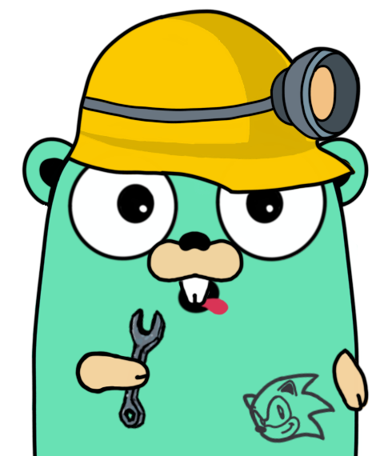

<div align="center">
    
</div>

<hr>

# UGO CLI
The cli of simplicity and power. This CLI tool is all you ever need to create a golang project.

# Installation
```shell
go get -u github.com/ugo-framework/ugo-cli
```

# Usage
```shell
ugocli -h // Displays help Command with all available commands, flags and its usage
ugc -h // Alias for ugocli

ugocli -v // Prints version number of the cli
// UGO CLI Version 0.1.0
// Go Version:  go1.14.1

ugocli create [PROJECT_NAME] // creates a project with ugo framework in a directory named [PROJECT_NAME]
ugocli run [PROJECT_ENTRY] // runs the entrypoint of a project

// eg
ugocli run main.go // Enables live reload support

```

# Features
UGO CLI is a powerful CLI tool for your go projects and continous in development. Currently ugo cli supports the following features.
- Fast and Simple
- Small in size
- Enables Live Reload (Currently upto depth 1. [See #1](https://github.com/ugo-framework/ugo-spectator/issues/1) )
- Enables creating project template.

# Development
If you want feel free to clone this repo. All the commands are in lib folder.

#  Contribute
If you want to contribute. Create a PR on a branch with proper title and descrption of what you did or what you fixed and how you did it.
